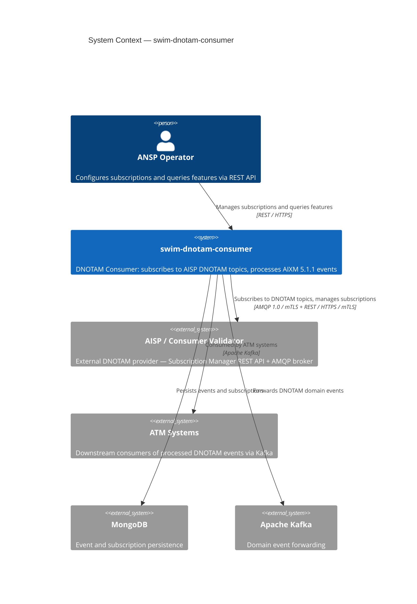
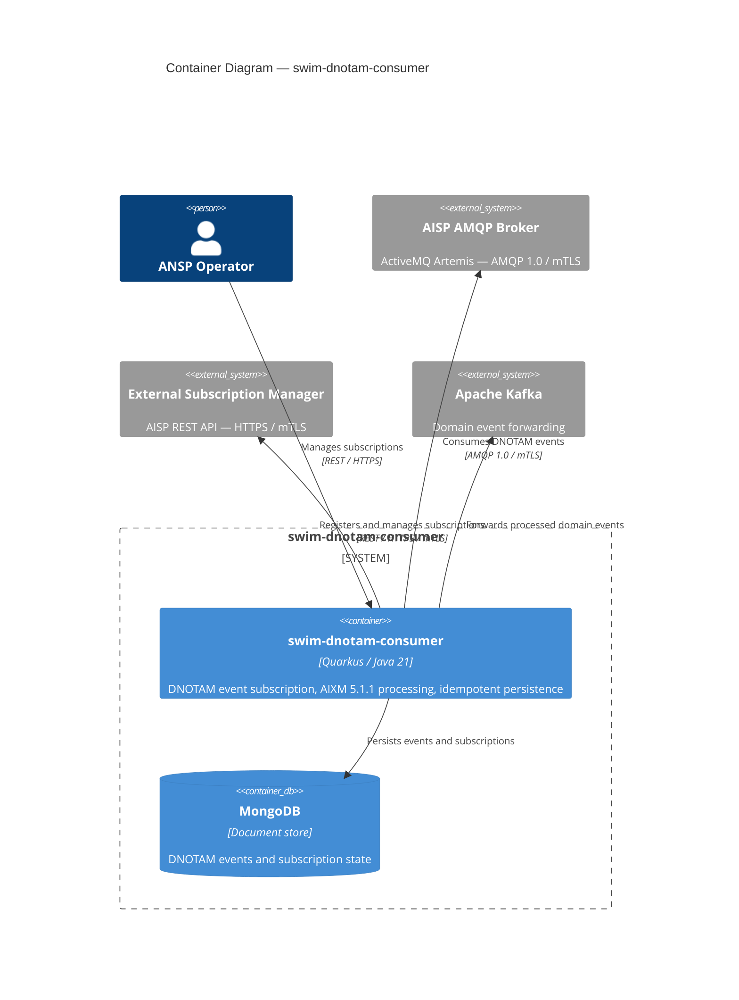
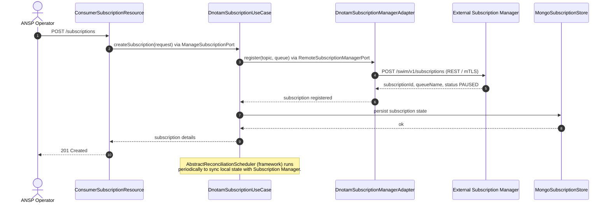
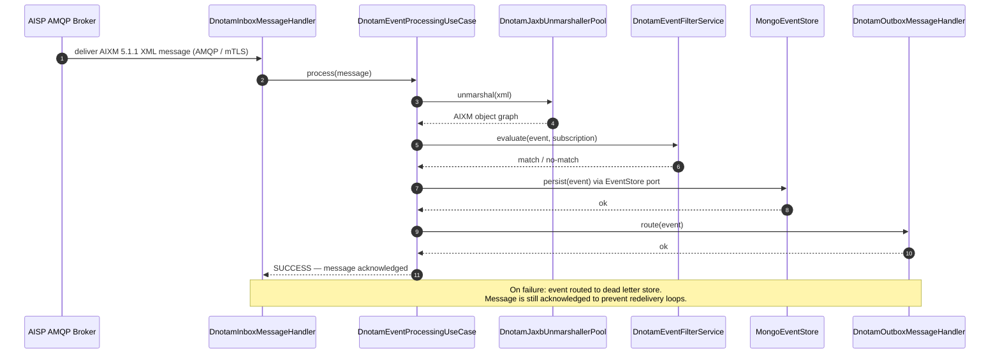

# swim-dnotam-consumer — Architecture

> Diagrams use [Mermaid](https://mermaid.js.org) and render natively on GitHub.

**Role**: ANSP (Air Navigation Service Provider) — consumes Digital NOTAM events from an external AISP via AMQP, processes AIXM 5.1.1 XML payloads, persists events to MongoDB, and forwards domain events to Kafka.

---

## 1. System Context (C4 Level 1)

---

## 2. Container Diagram (C4 Level 2)

---

## 3. Component Diagram (C4 Level 3)

```mermaid
C4Component
    title Component Diagram — swim-dnotam-consumer

    System_Ext(broker, "AISP AMQP Broker")
    System_Ext(sm, "External Subscription Manager")
    System_Ext(mongo, "MongoDB")
    System_Ext(kafka, "Apache Kafka")

    Container_Boundary(consumer, "swim-dnotam-consumer") {
        Component(subRes, "ConsumerSubscriptionResource", "JAX-RS / port/in", "REST endpoint — subscription CRUD")
        Component(evtRes, "ConsumerEventResource", "JAX-RS", "REST endpoint — event queries")
        Component(opRes, "OperationalResource", "JAX-RS", "Operational metrics and DLQ queries")
        Component(ftRes, "FeatureResource", "JAX-RS", "WFS-style feature queries (forwarded to Subscription Manager)")

        Component(inboxHandler, "DnotamInboxMessageHandler", "SmallRye Messaging", "AMQP consumer — receives events, delegates to event processing use case")
        Component(outboxHandler, "DnotamOutboxMessageHandler", "Kafka Producer", "Routes processed events to domain-specific Kafka topics")

        Component(subUC, "DnotamSubscriptionUseCase", "CDI", "Subscription lifecycle: create, pause, resume, delete — via Subscription Manager")
        Component(evtUC, "DnotamEventProcessingUseCase", "CDI", "Orchestrates: parse XML, validate, filter, persist, route to outbox")

        Component(filterSvc, "DnotamEventFilterService", "CDI", "Evaluates subscription filter criteria against event")
        Component(persistSvc, "DnotamEventPersistenceService", "CDI", "Persists event to MongoDB via EventStore port")
        Component(validator, "DnotamEventDataValidator", "CDI", "Validates event data against business rules")

        Component(jaxbPool, "DnotamJaxbUnmarshallerPool", "JAXB", "Thread-safe pool of JAXB unmarshallers for AIXM 5.1.1 XML")
        Component(extractor, "DnotamEventExtractor", "CDI / SwimEventExtractor SPI", "Extracts event type and metadata from AIXM Basic Message")
        Component(xmlParser, "DnotamXmlEnvelopeParser", "CDI", "Parses the AIXM Basic Message envelope")

        Component(smAdapter, "DnotamSubscriptionManagerAdapter", "MicroProfile REST Client", "HTTP client to external Subscription Manager — implements RemoteSubscriptionManagerPort")
        Component(mongoSub, "MongoSubscriptionStore", "Panache / port/out", "Subscription state persistence")
        Component(mongoEvt, "MongoEventStore", "Panache / port/out", "DNOTAM event persistence")
        Component(idempotency, "DnotamIdempotencyCacheDeclaration", "CDI", "Idempotency cache — prevents duplicate event processing")
    }

    Rel(subRes, subUC, "calls via", "ManageSubscriptionPort")
    Rel(inboxHandler, evtUC, "delegates to")
    Rel(evtUC, jaxbPool, "unmarshals with")
    Rel(evtUC, extractor, "extracts metadata with")
    Rel(evtUC, validator, "validates with")
    Rel(evtUC, filterSvc, "filters with")
    Rel(evtUC, persistSvc, "persists with")
    Rel(evtUC, outboxHandler, "routes to")
    Rel(subUC, smAdapter, "registers / updates via", "RemoteSubscriptionManagerPort")
    Rel(subUC, mongoSub, "persists via", "SubscriptionStore port")
    Rel(persistSvc, mongoEvt, "persists via", "EventStore port")

    Rel(inboxHandler, broker, "consumes", "AMQP 1.0 / mTLS")
    Rel(smAdapter, sm, "manages subscriptions", "REST / HTTPS / mTLS")
    Rel(mongoSub, mongo, "persists to")
    Rel(mongoEvt, mongo, "persists to")
    Rel(outboxHandler, kafka, "publishes to")
```

---

## 4. Subscription Lifecycle — Sequence

---

## 5. Event Processing — Sequence

