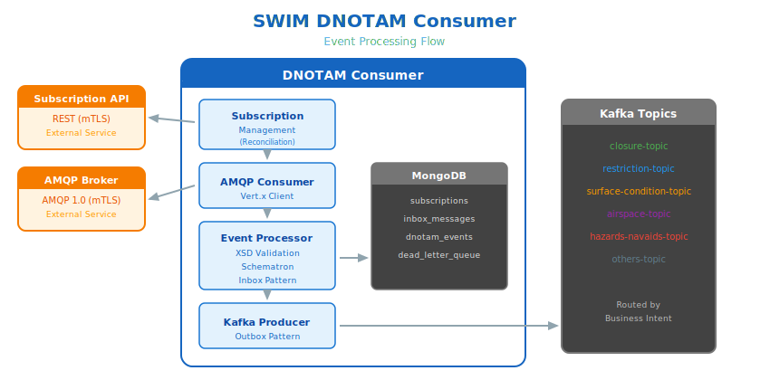

# SWIM DNOTAM Consumer

> ⚠️ **Code Under Review**: Source code is currently under internal review and will be available soon.

ANSP-role client for consuming Digital NOTAM events via SWIM infrastructure.

## What It Does

The Consumer connects to a SWIM Subscription Manager, creates subscriptions based on configuration, and receives DNOTAM events via AMQP. Events are validated, persisted, and distributed to Kafka topics by business intent.



**Capabilities:**
- Configuration-driven subscription management
- AMQP 1.0 consumption with mTLS
- XSD validation (AIXM 5.1.1)
- MongoDB persistence (Inbox/Outbox patterns)
- Kafka distribution by business intent (6 topics)
- GraphQL API for queries
- Distributed tracing (OpenTelemetry)

## Quick Start

### Using the Operator (Recommended)
```yaml
apiVersion: apps.swim-developer.github.io/v1alpha1nd: SwimDigitalNotamConsumer
metadata:
  name: swim-dnotam-client
spec:
  certManager:
    issuerName: swim-ca-issuer
    issuerKind: ClusterIssuer
  client:
    config:
      swimServiceBaseURL: 'https://mockserver-swim-external-provider.apps.ocp4.masales.cloud'
      amqpBrokerHost: 'mockserver-artemis-swim-external-provider.apps.ocp4.masales.cloud'
      amqpBrokerPort: 443
      dnotamSubscriptions: |
          [
            {
              "topic": "DigitalNOTAMService",
              "eventScenario": ["RWY.CLS", "AD.CLS", "TWY.CLS"],
              "airportHeliport": ["EADD", "LPPT"],
              "airspace": ["LPPC"],
              "description": "Closures for multiple airports"
            }
          ]
      swimXsdPath: '/opt/schemas/aixm-wrapper.xsd'
      observability:
        otelEndpoint: 'http://tempo-simplest-distributor.tempostack.svc.cluster.local:4317'
```

### Container Image

podman pull quay.io/masales/swim-dnotam-consumer:latest

## Kafka Topic Distribution

Events are routed to **6 topics** based on business intent:

| Topic | Scenarios | Use Case |
|-------|-----------|----------|
| `dnotam-events-closure-topic` | `RWY.CLS`, `AD.CLS`, `TWY.CLS`, `APN.CLS`, `STAND.CLS` | Flight cancellation/diversion |
| `dnotam-events-restriction-topic` | `RWY.LIM`, `AD.LIM`, `RCP.CHG`, `STAND.LIM`, `STAND.STS` | Weight/performance calculation |
| `dnotam-events-surface-condition-topic` | `SFC.CON` | Braking action, landing distance |
| `dnotam-events-airspace-topic` | `SAA.ACT`, `SAA.NEW` | Flight routing |
| `dnotam-events-hazards-navaids-topic` | `OBS.NEW`, `NAV.UNS`, `WLD.HZD` | Approach procedures |
| `dnotam-events-others-topic` | `UNKNOWN` | Monitoring, schema drift detection |

## Environment Variables

### MongoDB (Mandatory)

| Variable | Default | Description |
|----------|---------|-------------|
| `MONGODB_URI` | `mongodb://localhost:27017` | MongoDB connection string |
| `MONGODB_DATABASE` | `swim-dnotam` | Database name |

### Kafka (Mandatory)

| Variable | Default | Description |
|----------|---------|-------------|
| `KAFKA_BOOTSTRAP_SERVERS` | `kafka-kafka-bootstrap:9092` | Kafka bootstrap servers |

### SWIM Subscription Manager

| Variable | Default | Description |
|----------|---------|-------------|
| `SWIM_SERVICE_BASE_URL` | `https://swim-mockserver.apps.ocp4.masales.cloud` | Subscription Manager API URL |
| `SWIM_CLIENT_KEYSTORE_PATH` | `/secrets/client-keystore.p12` | Client certificate keystore (PKCS12) |
| `SWIM_CLIENT_KEYSTORE_PASSWORD` | *(empty)* | Keystore password |
| `SWIM_TRUSTSTORE_PATH` | `/secrets/truststore.p12` | CA truststore path |
| `SWIM_TRUSTSTORE_PASSWORD` | *(empty)* | Truststore password |

### AMQP Broker

| Variable | Default | Description |
|----------|---------|-------------|
| `AMQP_BROKER_HOST` | `swim-mockserver-artemis.apps.ocp4.masales.cloud` | AMQP broker hostname |
| `AMQP_BROKER_PORT` | `443` | AMQP port (TLS) |
| `AMQP_BROKER_USERNAME` | `admin` | AMQP username |
| `AMQP_BROKER_PASSWORD` | `admin` | AMQP password |
| `AMQP_MAX_CONCURRENT` | `50` | Max concurrent messages |
| `AMQP_BACKPRESSURE_THRESHOLD` | `40` | Backpressure threshold |

### Subscriptions

| Variable | Default | Description |
|----------|---------|-------------|
| `DNOTAM_SUBSCRIPTIONS` | *(see below)* | JSON array of desired subscriptions |
| `DNOTAM_DELETE_AND_RECREATE` | `true` | Recreate subscriptions on startup |

**Subscription JSON Format:**
```json
[
  {
    "topic": "DNOTAM/v1",
    "eventScenario": ["RWY.CLS", "AD.CLS"],
    "airportHeliport": ["LPPT", "EHAM"],
    "airspace": ["LPPC"],
    "description": "Runway closures"
  }
]
```

### Reconciliation

| Variable | Default | Description |
|----------|---------|-------------|
| `RECONCILIATION_RETRY_INTERVAL` | `10s` | Retry interval |
| `RECONCILIATION_RETRY_INITIAL_DELAY` | `30s` | Initial delay before first retry |

### XML Validation

| Variable | Default | Description |
|----------|---------|-------------|
| `SWIM_VALIDATION_ENABLED` | `true` | Enable XSD validation |
| `SWIM_VALIDATION_FAIL_ON_NULLBODY` | `false` | Fail on null body |
| `SWIM_XSD_PATH` | `/opt/schemas/aixm-wrapper.xsd` | Path to AIXM XSD schema |

### Observability

| Variable | Default | Description |
|----------|---------|-------------|
| `OTEL_ENABLED` | `true` | Enable OpenTelemetry |
| `OTEL_SDK_DISABLED` | `false` | Disable OTLP SDK |
| `OTEL_ENDPOINT` | `http://localhost:4317` | OTLP collector endpoint |
| `PROMETHEUS_ENABLED` | `true` | Enable Prometheus metrics |

### Logging

| Variable | Default | Description |
|----------|---------|-------------|
| `QUARKUS_LOG_LEVEL` | `INFO` | Log level (`TRACE`/`DEBUG`/`INFO`/`WARN`/`ERROR`) |

## Health Checks

| Endpoint | Purpose | Components Checked |
|----------|---------|-------------------|
| `/q/health/live` | Liveness probe | MongoDB, Kafka |
| `/q/health/ready` | Readiness probe | MongoDB, Kafka |
| `/q/health` | Overall health | All + Reconciliation status |

## REST API

| Method | Endpoint | Description |
|--------|----------|-------------|
| `GET` | `/api/v1/subscriptions` | List all subscriptions |
| `GET` | `/api/v1/subscriptions/active` | List active subscriptions |
| `POST` | `/api/v1/subscriptions` | Create manual subscription |
| `PUT` | `/api/v1/subscriptions/{id}` | Update status (ACTIVE/PAUSED) |
| `DELETE` | `/api/v1/subscriptions/{id}` | Delete subscription |
| `GET` | `/api/v1/subscriptions/{id}/messages` | List messages (paginated) |
| `GET` | `/api/v1/dlq` | List dead letter queue messages |

**Swagger UI:** `<SERVER_URL>/swagger-ui`

## GraphQL API

| Endpoint | Description |
|----------|-------------|
| `/graphql` | GraphQL API |
| `/q/graphql-ui` | Interactive Playground |

**Example Queries:**

### List recent events
```yaml
query {
  dnotamEvents(limit: 100) {
    eventId
    eventScenario
    airportHeliport
    receivedAt
  }
}
```

### Filter by airport and scenario
```yaml
query {
  dnotamEvents(scenario: "RWY.CLS", airport: "LPPT", limit: 50) {
    eventId
    notamNumber
    validTimeStart
    validTimeEnd
  }
}
```

### Event distribution by scenario
```yaml
query {
  scenarioDistribution {
    scenario
    count
  }
}
```

### Top airports by activity
```yaml
query {
  topAirports(limit: 10) {
    airport
    count
  }
}
```

## Technology Stack

| Component | Technology |
|-----------|------------|
| Runtime | Quarkus (Native/JVM) |
| Persistence | MongoDB |
| Streaming | Apache Kafka |
| Messaging | AMQP 1.0 (Vert.x Client) |
| Security | mTLS (PKCS12) |
| Validation | AIXM 5.1.1 XSD |
| Tracing | OpenTelemetry |
| Metrics | Prometheus |

## Standards Alignment

| Standard | Description | Status |
|----------|-------------|--------|
| EUROCONTROL SPEC-170 | SWIM-TI Yellow Profile | ✅ Implemented, ⏳ Pending Validation |
| EUROCAE ED-254 | Service Interface Bindings | ✅ Implemented, ⏳ Pending Validation |
| EU Regulation 2021/116 | Common Project One (CP1) | ✅ Implemented, ⏳ Pending Validation |
| AIXM 5.1.1 | Aeronautical Information Exchange Model | ✅ Implemented |

## License

BSD 3-Clause License

---

Part of the [swim-developer](https://swim-developer.github.io) initiative.
