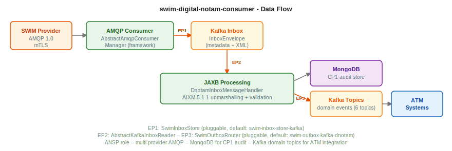

# swim-digital-notam-consumer

ANSP-role client for consuming Digital NOTAM events via SWIM infrastructure. Connects to one or more SWIM Subscription Managers, creates subscriptions based on configuration, receives DNOTAM events via AMQP 1.0 over TLS, validates against AIXM 5.1.1 XSD, persists to MongoDB, and distributes to Kafka topics by business intent.



## What it does

- **Configuration-driven subscriptions**, declares desired subscriptions as JSON, reconciles them automatically against the provider
- **Multi-provider support**, connects to multiple SWIM providers simultaneously, each with independent mTLS and AMQP configuration
- **AMQP 1.0 consumption**, receives DNOTAM events with mTLS, backpressure control, and batch staging via Kafka inbox
- **XSD validation**, validates incoming AIXM 5.1.1 messages against schema before processing
- **MongoDB persistence**, stores events and subscriptions with idempotency cache and dead letter queue
- **Kafka distribution**, routes events to 6 topic categories by business intent (closures, restrictions, surface conditions, airspace, hazards, unknown)
- **Subscription renewal**, automatic renewal before expiration with configurable threshold
- **Heartbeat monitoring**, detects provider heartbeat loss per subscription
- **Outbox pattern**, reliable event delivery with recovery and cleanup schedulers
- **GraphQL API**, query events by scenario, airport, time range
- **Observability**, OpenTelemetry tracing, Prometheus metrics, structured logging

---

## GET STARTED

### Prerequisites

- Java 21
- Maven 3.9+
- [Podman Desktop](https://podman-desktop.io), includes the Podman engine and a graphical interface for managing containers and compose stacks. Any OCI-compatible runtime with Compose support also works.
- [mkcert](https://github.com/FiloSottile/mkcert), local certificate authority

  **macOS**
  ```bash
  brew install mkcert
  ```

  **Fedora / RHEL**
  ```bash
  sudo dnf install nss-tools
  curl -Lo mkcert https://dl.filippo.io/mkcert/latest?for=linux/amd64
  chmod +x mkcert
  sudo mv mkcert /usr/local/bin/
  ```

  **Debian / Ubuntu**
  ```bash
  sudo apt install libnss3-tools
  curl -Lo mkcert https://dl.filippo.io/mkcert/latest?for=linux/amd64
  chmod +x mkcert
  sudo mv mkcert /usr/local/bin/
  ```

  **Linux (Homebrew)**
  ```bash
  brew install mkcert
  ```

  **Windows (Chocolatey)**
  ```powershell
  choco install mkcert
  choco install openssl
  ```

  **Windows (Scoop)**
  ```powershell
  scoop bucket add extras
  scoop install mkcert
  scoop install openssl
  ```

  > On Windows, `openssl` is also bundled with Git for Windows and is usually already on the PATH.

### 0. Generate local certificates

The consumer connects to the validator's Artemis broker via mTLS on port 5671 by default. Generate the certificates before starting the infrastructure.

**macOS / Linux**
```bash
./certs/generate.sh
```

**Windows (PowerShell)**
```powershell
.\certs\generate.ps1
```

This is a one-time step per machine. It uses `mkcert` to create a local CA (installed into your system trust store), then generates:

- `certs/broker.p12`: Artemis broker keystore, mounted into the validator container
- `certs/ca-truststore.p12`: CA truststore for Artemis, used to verify the consumer client cert
- `certs/keystore.jks`: consumer client keystore, used by the Quarkus dev profile
- `certs/truststore.jks`: consumer CA truststore, used by the Quarkus dev profile

The broker certificate covers `localhost`, `127.0.0.1`, `dnotam-consumer-validator-artemis`, `artemis.127.0.0.1.nip.io`, and `dnotam-consumer-validator-artemis.127.0.0.1.nip.io`. No `/etc/hosts` entries needed.

### 1. Start the local infrastructure

The `compose.yml` at the root of this project brings up everything the consumer needs: a fake SWIM provider (Subscription Manager API + AMQP broker + AIXM event generator), MongoDB, and Kafka.

The Artemis broker is built from `src/local-dev/artemis/`. Use `--build` the first time, or after any change to those files:

```bash
podman compose up --build -d
```

On subsequent runs, when nothing in `src/local-dev/artemis/` has changed, the cached image is used:

```bash
podman compose up -d
```

> **Tip:** [Quarkus Dev Services](https://quarkus.io/guides/dev-services) can also provision databases and brokers automatically during `./mvnw quarkus:dev`, as an alternative to the `compose.yml`.

Services started:

| Service | Port | Description |
|---------|------|-------------|
| `dnotam-consumer-validator` | 8084 | Mock Subscription Manager REST API + event generator |
| `dnotam-consumer-validator-artemis` | 5671 (AMQPS/mTLS), 5672 (plain), 8161 | AMQP broker (fake provider side) |
| `dnotam-consumer-validator-mariadb` | 3307 | Validator persistence |
| `dnotam-consumer-mongodb` | 27017 | Consumer event store |
| `dnotam-consumer-mongo-express` | 9081 | MongoDB web UI |
| `kafka` | 9092 | Kafka broker (KRaft) |
| `dnotam-consumer-akhq` | 9080 | Kafka web UI (AKHQ) |

#### About the consumer validator

The `dnotam-consumer-validator` simulates a real SWIM provider: it exposes the Subscription Manager REST API, manages an Artemis broker, and periodically publishes real AIXM DNOTAM events. The consumer connects to it exactly as it would connect to a production EUROCONTROL provider.

The compose uses the pre-built image `quay.io/masales/swim-dnotam-consumer-validator:latest`, pulled fresh on every `podman compose up`.

If you want to run the validator from source instead of the pre-built image, clone `swim-dnotam-consumer-validator`, start its infrastructure separately, and run:

```bash
./mvnw quarkus:dev
```

Then update `src/main/resources/application-dev.properties` to point `swim.providers` at the locally running validator instead of the compose container.

### 2. Run the consumer

```bash
./mvnw quarkus:dev
```

Add `-Ddebug=false` to skip the remote debug port (5005) if you do not need a debugger attached:

```bash
./mvnw quarkus:dev -Ddebug=false
```

To make the REST API accessible from other machines on the same network (useful on headless servers or VMs), bind to all interfaces:

```bash
./mvnw quarkus:dev -Dquarkus.http.host=0.0.0.0 -Ddebug=false
```

The API will be reachable at `http://<your-ip>:8080`.

The `dev` profile connects to the infrastructure above. The consumer will subscribe to the validator, receive AIXM events, persist them to MongoDB, and publish to Kafka.

| URL | Description |
|-----|-------------|
| http://localhost:8080 | REST API |
| http://localhost:8080/swagger-ui | Swagger UI |
| http://localhost:8080/q/graphql-ui | GraphQL playground |
| http://localhost:8080/q/health | Health |
| http://localhost:8161 | Artemis console (admin / admin) |
| http://localhost:9081 | MongoDB UI |
| http://localhost:9080 | Kafka UI (AKHQ) |

### 3. Verify, happy path

Wait ~30 seconds for the consumer to reconcile subscriptions with the validator. Then:

```bash
# Check overall health
curl -s http://localhost:8080/q/health | jq .status

# List subscriptions, at least one should be ACTIVE
curl -s http://localhost:8080/api/v1/subscriptions | jq '.[] | {id, status, topic}'

# List subscriptions, confirmed ACTIVE means events are flowing
curl -s "http://localhost:8080/api/v1/subscriptions" | jq '.[] | {id, status, topic}'
```

Or use GraphQL:

```bash
curl -s -X POST http://localhost:8080/graphql \
  -H "Content-Type: application/json" \
  -d '{"query":"{ dnotamEvents(limit: 5) { eventId notamNumber validTimeStart } }"}' | jq .
```

The consumer is working correctly when:
- `GET /q/health/ready` returns `{"status":"UP"}`
- At least one subscription shows `"status":"ACTIVE"`
- Events appear in MongoDB (http://localhost:9081 → `swim-dnotam` db → `events` collection)
- Events appear in Kafka topics (http://localhost:9080, AKHQ)

### mTLS in dev mode

The default dev profile connects to the validator's Artemis on port **5671** using mTLS. This matches production behaviour and is the recommended approach.

If you need to temporarily bypass mTLS (for example, to isolate a connectivity issue), edit `application-dev.properties` to switch to the plain AMQP port:

```properties
# switch provider amqpBroker port from 5671 to 5672 and set sslEnabled to false
swim.providers=[{"providerId":"validator","subscriptionManager":{"url":"http://localhost:8084","tls":null,...},"amqpBroker":{"host":"localhost","port":5672,"sslEnabled":false,"username":"admin","password":"admin","tls":null}}]
swim.amqp.host=localhost
swim.amqp.port=5672
swim.amqp.ssl.enabled=false
```

The plain AMQP port 5672 on the validator container is always available alongside 5671. Revert to mTLS once the issue is identified.

---

## Kafka topic distribution

Events are routed to topics based on business intent:

| Topic | Scenarios | Use case |
|-------|-----------|----------|
| `dnotam-events-closure-topic` | `RWY.CLS`, `AD.CLS`, `TWY.CLS`, `APN.CLS`, `STAND.CLS` | Flight cancellation/diversion |
| `dnotam-events-restriction-topic` | `RWY.LIM`, `AD.LIM`, `RCP.CHG`, `STAND.LIM`, `STAND.STS` | Weight/performance calculation |
| `dnotam-events-surface-condition-topic` | `SFC.CON` | Braking action, landing distance |
| `dnotam-events-airspace-topic` | `SAA.ACT`, `SAA.NEW` | Flight routing |
| `dnotam-events-hazards-navaids-topic` | `OBS.NEW`, `NAV.UNS`, `WLD.HZD` | Approach procedures |
| `dnotam-events-others-topic` | `UNKNOWN` | Monitoring, schema drift detection |

---

## REST API

| Method | Endpoint | Description |
|--------|----------|-------------|
| `GET` | `/api/v1/subscriptions` | List all subscriptions |
| `GET` | `/api/v1/subscriptions/active` | List active subscriptions |
| `POST` | `/api/v1/subscriptions` | Create manual subscription |
| `PUT` | `/api/v1/subscriptions/{id}` | Update status (ACTIVE/PAUSED) |
| `DELETE` | `/api/v1/subscriptions/{id}` | Delete subscription |
| `GET` | `/api/v1/topics` | List topics from ConfigMap |
| `GET` | `/api/v1/subscriptions/{id}/events` | List events (paginated) |
| `GET` | `/api/v1/subscriptions/{id}/events/count` | Count events |
| `GET` | `/api/v1/subscriptions/{id}/events/range` | Events by date range |
| `GET` | `/api/v1/events/{messageId}` | Get event by AMQP message ID |
| `GET` | `/api/v1/dlq` | List dead letter queue (paginated) |
| `GET` | `/api/v1/dlq/count` | Count DLQ messages |
| `GET` | `/api/v1/stats` | Consumer statistics |

Swagger UI available at `/swagger-ui`.

---

## Postman testing

A ready-to-import Postman collection is available in `src/test/postman/`:

| File | Description |
|------|-------------|
| `SWIM-DNOTAM-Consumer.postman_collection.json` | Full REST API coverage: subscriptions, events, operational |
| `SWIM-Local.postman_environment.json` | Local environment: `consumer_url=http://localhost:8080`, `validator_url=http://localhost:8084` |

### How to import

1. Open Postman → **Import** → select both files.
2. Select **SWIM Local** as the active environment.
3. Run requests in order following the demo flow described in the collection description.

### Demo flow (happy path)

1. **Subscriptions / Create** — creates a subscription and stores `sub_id` automatically.
2. **Subscriptions / List all** — confirms the subscription exists.
3. **Subscriptions / Pause** — pauses; verify with **List active** (should not appear).
4. **Subscriptions / Resume** — resumes; verify with **List active** (appears again).
5. **Events / List by subscription** — once DNOTAM events arrive, browse them here.
6. **Operational / Consumer statistics** — overall health and counters.
7. **Operational / DLQ count** — must be `0` on a healthy consumer.
8. **Subscriptions / Delete** — clean up.

All requests can also be run with `curl`. Examples:

```bash
# Create a subscription
curl -s -X POST http://localhost:8080/api/v1/subscriptions \
  -H "Content-Type: application/json" \
  -d '{"topic":"DNOTAM/v1","eventScenario":["RWY.CLS"],"airportHeliport":["EADD"],"description":"Test"}' | jq .

# List all subscriptions
curl -s http://localhost:8080/api/v1/subscriptions | jq .

# Consumer statistics
curl -s http://localhost:8080/api/v1/stats | jq .

# DLQ count (should be 0)
curl -s http://localhost:8080/api/v1/dlq/count | jq .
```

## GraphQL API

Available at `/graphql` with interactive playground at `/q/graphql-ui`.

```graphql
query {
  dnotamEvents(scenario: "RWY.CLS", airport: "LPPT", limit: 50) {
    eventId
    notamNumber
    validTimeStart
    validTimeEnd
  }
}
```

---

## Environment variables

### Provider connection (`SWIM_PROVIDERS`)

The full provider configuration is a JSON array set via `SWIM_PROVIDERS`. Each entry configures one external SWIM provider.

```json
[
  {
    "providerId": "my-provider",
    "subscriptionManager": {
      "url": "https://sm.provider.example",
      "tls": {
        "trustStorePath": "/certs/truststore.jks",
        "trustStorePassword": "changeit",
        "keyStorePath": "/certs/keystore.jks",
        "keyStorePassword": "changeit"
      }
    },
    "amqpBroker": {
      "host": "amqp.provider.example",
      "port": 5671,
      "sslEnabled": true,
      "tls": {
        "trustStorePath": "/certs/truststore.jks",
        "trustStorePassword": "changeit",
        "keyStorePath": "/certs/keystore.jks",
        "keyStorePassword": "changeit"
      }
    }
  }
]
```

### Subscriptions (`DNOTAM_SUBSCRIPTIONS`)

```json
[
  {
    "topic": "DNOTAM/v1",
    "provider": "my-provider",
    "eventScenario": ["RWY.CLS", "AD.CLS"],
    "airportHeliport": ["LPPT", "EHAM"],
    "description": "Runway and aerodrome closures"
  }
]
```

### All variables

| Variable | Default | Description |
|----------|---------|-------------|
| `SWIM_PROVIDERS` | `[{...localhost...}]` | JSON array of SWIM provider configurations (SM URL + AMQP broker) |
| `DNOTAM_SUBSCRIPTIONS` |: | JSON array of desired subscriptions |
| `DNOTAM_DELETE_AND_RECREATE` | `true` | Recreate subscriptions on startup |
| `MONGODB_URI` | `mongodb://localhost:27017` | MongoDB connection string |
| `MONGODB_DATABASE` | `swim-dnotam` | MongoDB database name |
| `KAFKA_BOOTSTRAP_SERVERS` | `kafka-kafka-bootstrap:9092` | Kafka bootstrap servers |
| `SWIM_VALIDATION_ENABLED` | `true` | Enable XSD validation against AIXM 5.1.1 |
| `SWIM_VALIDATION_FAIL_ON_NULLBODY` | `false` | Reject messages with null body |
| `SWIM_RENEWAL_ENABLED` | `true` | Enable automatic subscription renewal |
| `SWIM_RENEWAL_CHECK_INTERVAL` | `5m` | How often to check for expiring subscriptions |
| `SWIM_RENEWAL_THRESHOLD` | `1h` | Renew when less than this time remains |
| `RECONCILIATION_RETRY_INTERVAL` | `10s` | Retry interval for subscription reconciliation |
| `RECONCILIATION_RETRY_INITIAL_DELAY` | `30s` | Initial delay before first reconciliation attempt |
| `SWIM_SCHEDULER_INITIAL_DELAY` | `30s` | Startup delay before schedulers begin |
| `SWIM_OUTBOX_RECOVERY_INTERVAL` | `30s` | Outbox recovery sweep interval |
| `SWIM_OUTBOX_MAX_RETRIES` | `5` | Max retry attempts for outbox delivery |
| `SWIM_IDEMPOTENCY_CACHE_SIZE` | `100000` | Max entries in idempotency cache |
| `SWIM_IDEMPOTENCY_CACHE_TTL` | `24H` | Cache TTL for processed message IDs |
| `OTEL_ENABLED` | `true` | Enable OpenTelemetry tracing |
| `OTEL_ENDPOINT` | `http://localhost:4317` | OTLP collector endpoint |
| `PROMETHEUS_ENABLED` | `true` | Enable Prometheus metrics at `/q/metrics` |
| `VERTX_WORKER_POOL_SIZE` | `100` | Vert.x worker thread pool size |
| `THREAD_POOL_MAX_THREADS` | `250` | Max application thread pool size |

---

## Container images

Pre-built multi-arch images (linux/amd64 + linux/arm64):

```
quay.io/masales/swim-dnotam-consumer:latest
```

Run with Podman (or any OCI runtime):

```bash
podman run -p 8080:8080 \
  -e MONGODB_URI=mongodb://host:27017 \
  -e KAFKA_BOOTSTRAP_SERVERS=host:9092 \
  -e SWIM_PROVIDERS='[{...}]' \
  -e DNOTAM_SUBSCRIPTIONS='[{...}]' \
  quay.io/masales/swim-dnotam-consumer:latest
```

---

## Build

### From source

```bash
./mvnw clean package -DskipTests
```

### Container images

```bash
make jvm                 # JVM multi-arch image, build + push  (fastest)

make native-amd64        # Native amd64, build + push  (run on amd64 machine)
make native-arm64        # Native arm64, build + push  (run on arm64 machine)
make manifest            # Create multi-arch manifest from registry images
make push                # Push manifest to registry
```

Override registry or tag: `make jvm REGISTRY=quay.io/myorg TAG=v1.2.3`

Run `make deps` to see which sibling repos to install first.

---

## Testing

### Unit tests

Run fast, no containers, no I/O:

```bash
mvn test
```

### Integration tests (JVM mode)

Run with real infrastructure via Testcontainers (MongoDB, Kafka/Redpanda, Artemis, WireMock). These test the full consumer pipeline in a JVM process.

```bash
mvn verify -DskipITs=false
```

> Run one project at a time. Integration tests bind to host ports; running multiple projects in parallel causes port conflicts.

### Native integration tests

Compile the application to a GraalVM native executable and run the test suite against the binary. This catches issues that JVM-mode tests cannot detect:

| Issue | Why JVM misses it | Caught by native IT |
|---|---|---|
| CDI raw-type injection | ArC wires types lazily in JVM | Wired at build time in native; startup fails if broken |
| MongoDB POJO codec | Reflection available by default in JVM | Classes without `@RegisterForReflection` excluded in native |
| Quarkus cache registration | Caches registered on first use in JVM | Must be declared at build time in native via `@CacheResult` |

```bash
mvn verify -Pnative
```

> Native compilation takes 5-15 minutes depending on the machine. Run only when validating a new image before deployment or after changes to CDI beans, MongoDB projections, or cache configuration.

The native IT tests live in `src/test/java/.../native_it/DnotamConsumerNativeIT.java` and are skipped by default (`skipITs=true`). The `native` Maven profile sets `skipITs=false` and enables `quarkus.native.enabled=true`.

---

## Health checks

| Endpoint | Description |
|----------|-------------|
| `/q/health/live` | Liveness probe |
| `/q/health/ready` | Readiness probe |
| `/q/health` | Combined status |

---

## Deployment

Helm chart in `src/main/helm/` with CRC and production values.

For operator-based deployment (single CR), see [swim-operator](https://github.com/swim-developer/swim-operator).

---

## Related projects

| Project | Why you need it |
|---------|----------------|
| [swim-digital-notam-consumer-validator](https://github.com/swim-developer/swim-developer-validators) | Fake SWIM provider for local testing: included in `compose.yml` |
| [swim-developer-extensions](https://github.com/swim-developer/swim-developer-extensions) | Kafka outbox routers that forward events from this consumer to downstream systems |
| [aixm-model](https://github.com/swim-developer/aixm-model) | AIXM 5.1.1 JAXB bindings used internally |
| [swim-developer-framework](https://github.com/swim-developer/swim-developer-framework) | Core framework this service is built on |
| [swim-developer-tools](https://github.com/swim-developer/swim-developer-tools) | Infrastructure tooling: cert generation, full-stack compose, pipelines |

---

## License

Licensed under the [Apache License 2.0](LICENSE).
